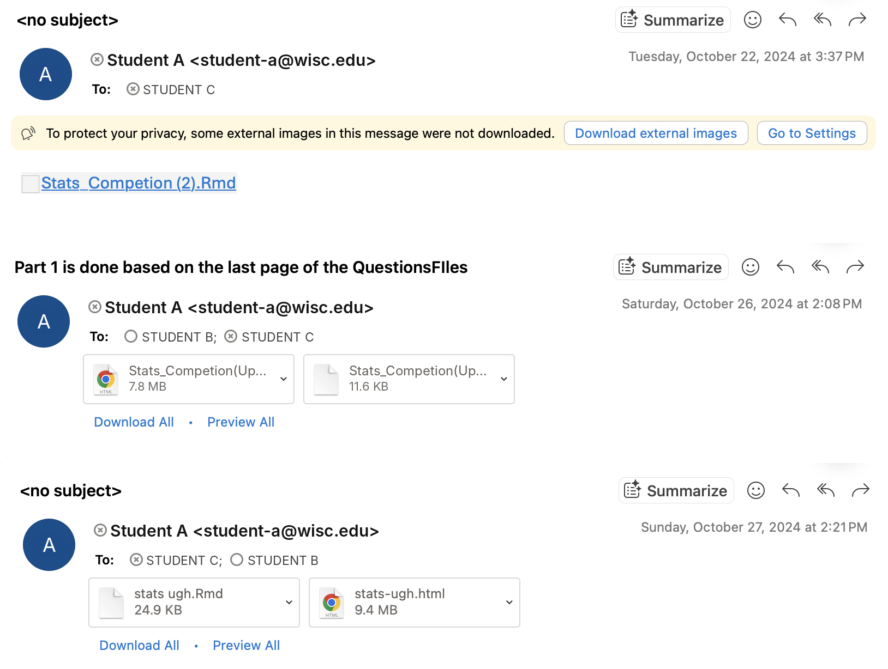

# Graduating from Notebooks

These are the notes for my workshop titled *Graduating from Notebooks* given on Thursday, October 8th, 2026 in Mogridge Hall to the *Undergraduate Statistics Club* of the University of Wisconsin–Madison.

**Background.** This workshop assumes that you know either `R` or `python`, and have performed some sort of data analysis in that language (Ex. *linear regression*). I will teach this workshop in `python`, but will try my best to talk about the higher level ideas which generalize to `R`.

**Structure.**  Setup $\rightarrow$ Source Files $\rightarrow$ Project Structure $\rightarrow$ Git $\rightarrow$ GitHub

### 0. Setup (please do this before the workshop)
-----

You'll get the most out of this if you can run every command along with me. All you need is a terminal (Terminal on macOS, Git Bash or WSL on Windows), [Git](https://git-scm.com/downloads), and either Python 3.10+ or R 4.1+.

**Get the code.**
```bash
git clone https://github.com/spencervenancio/gfnb.git
cd gfnb
```

**Python.** Create a *virtual environment* (an isolated folder of packages just for this project), then install everything:
```bash
python3 -m venv .venv
source .venv/bin/activate         # Windows: .venv\Scripts\activate
cd demo
pip install -r requirements.txt   # also installs the demo/ project itself (the `-e .` line)
cd ..
python3 check_setup.py
```
<details>
<summary>Using conda or uv instead?</summary>

```bash
# conda
conda create -n gfnb python=3.12 && conda activate gfnb
cd demo && pip install -r requirements.txt && cd ..

# uv
uv venv && source .venv/bin/activate
cd demo && uv pip install -r requirements.txt && cd ..
```
</details>

**R.** The R version of the analysis ([`diabetes.R`](diabetes.R)) only uses base R. Check your setup with:
```bash
Rscript check_setup.R
```

If everything comes back with a green ✓, you're ready. If not, the checker tells you what to fix.

### 1. Source Files
----- 

####  **Why do we even need source files at all?**

You might be used to working in Jupyter Notebook. You might also be thinking something like
> I've used Jupyter Notebooks (`.ipynb`) or R Markdown (`.rmd`) for all of my statistics/data science courses. And now you're telling me this isn't enough? What's with that?

To motivate this, let's take a look at [`diabetes.ipynb`](diabetes.ipynb). We can see that it does a few things: 
 1. Uses the [`load_diabetes`](https://scikit-learn.org/stable/modules/generated/sklearn.datasets.load_diabetes.html) function to load `X` as a [`pd.DataFrame`](https://pandas.pydata.org/docs/reference/api/pandas.DataFrame.html) and `y` as a [`pd.Series`](https://pandas.pydata.org/docs/reference/api/pandas.Series.html#pandas.Series). 
 2. Displays them for verification
 3. Performs a [`train_test_split`](https://scikit-learn.org/stable/modules/generated/sklearn.model_selection.train_test_split.html)
 4. Fits a [`LinearRegression`](https://scikit-learn.org/stable/modules/generated/sklearn.linear_model.LinearRegression.html) model using the training data.
 5. Makes predictions using the testing data
 6. Uses [`root_mean_squared_error`](https://scikit-learn.org/stable/modules/generated/sklearn.metrics.root_mean_squared_error.html#sklearn.metrics.root_mean_squared_error) to calculate the test loss: 

$$\mathrm{RMSE}=\sqrt{\frac{\sum_{i=1}^n (\hat y_i- y_i)^2}{n}} $$

But then you remember that you should rescale (normalize) your `X` matrix, so that all of your features are on the same scale. So you go ahead and add: 

 7. Use [`StandardScaler`](https://scikit-learn.org/stable/modules/generated/sklearn.preprocessing.StandardScaler.html#sklearn.preprocessing.StandardScaler) to rescale the data to have mean $0$ and variance $1$.

**To see where this is headed:** notice how things are already getting disorganized. *Imagine what happens if you want to extend this, or collaborate with another person?* What happens when: 

- You have multiple data sets
- Multiple Models, and some sort of model selection procedure
- The data isn't clean, and you have to enforce formatting in one of the columns
- You rerun similar code with different inputs

> **Lesson 1.** *Jupyter Notebooks/R Markdown are great development tools, and they allow for really quick building. But they promote poor coding practice, whereas rewriting important code in source files will do the opposite.*

#### **So, what do *source files* even mean?** 

It's simple really, if you're used to Jupyter Notebooks (`.ipynb`), you will now write python (`.py`) files. If you're used to R Markdown (`.Rmd`) you will now write R (`.R`) files. Let's look at what the same analysis would look like in a python file

Take a look at [`diabetes.py`](diabetes.py) (or [`diabetes.R`](diabetes.R) for the R version). It is about the simplest, most naive way to use a python file. It: 

- Has the same imports
- Loads, and splits the data
- Scales the data
- Fits a model on train data
- Makes predictions on test data
- Prints RMSE

You have to run it in your terminal. This is another key idea of this presentation: 
> **Lesson 2.** *Get hip with your terminal, it's one of the most important and least taught technologies.*

```bash 
python3 diabetes.py   # Python
Rscript diabetes.R    # R
``` 
Run it a few times. Notice the RMSE changes every run? That's because the train/test split is random. Setting a seed (`random_state=` in `train_test_split`, `set.seed()` in R) makes it reproducible, which matters a lot once other people are trying to reproduce your results.

| | Python | R |
|---|---|---|
| Run a script | `python3 file.py` | `Rscript file.R` |
| Start an interactive session | `python3` (or `ipython`) | `R` |
| Run a script, then stay in the session to poke around | `python3 -i file.py` | `R`, then `source("file.R")` |

But you almost never actually write data analysis code all in one file like this. You can imagine as your project grows (especially with collaborators), this file could grow to be hundreds, and potentially thousands of lines long. **The solution? Split the project into small files,** where each file handles a specific part. One file for preprocessing, another for training, another for predicting on live data. Now let's talk about:
  
### 2. Project Structure
--- 
#### **Background**
I first started to think about data science project structure when I interned at Nokomis Health, and I was really the only one doing data science there. I basically got handed access to an Oracle Cloud Data Science Jupyter Lab, and it was my job to figure out how to set myself up. This was when I discovered [Cookie Cutter Data Science](https://cookiecutter-data-science.drivendata.org/), and learned another fundamental principle of data science: 

> **Lesson 3.** *Good projects die in notebooks. Notebooks are not production ready, and R&D projects that never get finished go unused.*

I won't go over all of the ideas relating to project structure. In general, I think you'll learn the most if you build, and occasionally learn more as needed. It can be hard to understand **why** a certain choice is good or bad until you make the mistakes. If you want a starting place, I really recommend reading the [Opinions section](https://cookiecutter-data-science.drivendata.org/opinions/) on CCDS. The main ideas they cover are: 

1. Data analysis is a directed acyclic graph
2. Raw data is immutable
3. Data should (mostly) not be kept in source control
5. **Notebooks are for exploration and communication, source files are for repetition**
6. **Refactor the good parts into source code**
7. **Keep your modeling organized**
8. **Build from the environment up**
9. Keep secrets and configuration out of version control
10. Store your secrets and config variables in a special file
12. **Encourage adaptation from a consistent default**

#### **Example Template**

So, what do they recommend? This is a slightly more barebones version of a `ccds` project

```bash
pip install cookiecutter-data-science   # one time
ccds 
```
It will then ask you some questions. The barebones answers will create a project with the structure:

```
├── Makefile           <- Makefile with convenience commands like `make data` or `make train`
├── README.md          <- The top-level README for developers using this project.
├── data
│   ├── external       <- Data from third party sources.
│   ├── interim        <- Intermediate data that has been transformed.
│   ├── processed      <- The final, canonical data sets for modeling.
│   └── raw            <- The original, immutable data dump.
│
├── models             <- Trained and serialized models, model predictions, or model summaries
│
├── notebooks          <- Jupyter notebooks. Naming convention is a number (for ordering),
│                         the creator's initials, and a short `-` delimited description, e.g.
│                         `1.0-jqp-initial-data-exploration`.
│
├── pyproject.toml     <- Project configuration file with package metadata for 
│                         demo and configuration for tools like ruff
│
├── references         <- Data dictionaries, manuals, and all other explanatory materials.
│
├── reports            <- Generated analysis as HTML, PDF, LaTeX, etc.
│   └── figures        <- Generated graphics and figures to be used in reporting
│
├── requirements.txt   <- The requirements file for reproducing the analysis environment, e.g.
│                         generated with `pip freeze > requirements.txt`
│
└── demo   <- Source code for use in this project.
    │
    ├── __init__.py             <- Makes demo a Python module
    │
    ├── config.py               <- Store useful variables and configuration
    │
    ├── dataset.py              <- Scripts to download or generate data
    │
    ├── features.py             <- Code to create features for modeling
    │
    ├── modeling                
    │   ├── __init__.py 
    │   ├── predict.py          <- Code to run model inference with trained models          
    │   └── train.py            <- Code to train models
    │
    └── plots.py                <- Code to create visualizations
```

`ccds` is a really great resource, because it will teach you about how to structure a project well **while** you use it to build a project. 

We won't go over the details of the `Makefile`, `pyproject.toml`, and some of the other packages they encourage but let's take a closer look at the source code directory: `demo/` 

Each file does exactly one step, and each step reads the previous step's output from `data/`. This is the "data analysis is a DAG" idea in action:

```
dataset.py ──> data/raw/ ──> features.py ──> data/processed/ ──> train.py ──> models/model.joblib
                  │                               │                                   │
                  └───────────────────────────────┴──────────────> predict.py <───────┘
```

So you run them in order, from inside `demo/`:

```bash 
cd demo
python3 demo/dataset.py            # download + split  -> data/raw/
python3 demo/features.py           # scale             -> data/processed/
python3 demo/modeling/train.py     # fit               -> models/model.joblib
python3 demo/modeling/predict.py   # predict + RMSE
```

Now if you want to try a different model, you only touch `train.py` and rerun the last two steps. If you get new data, you rerun from the top. Nobody has to scroll through a notebook to figure out which cells to rerun.

#### **Dependencies: "it works on my machine"**

Remember the CCDS opinion **build from the environment up**? The first thing that breaks when you share code isn't the code, it's the *environment*: your collaborator has a different version of `pandas`, or doesn't have `typer` installed at all. The fix is to (1) give every project its own isolated environment, and (2) write down exactly what's in it, in a file that lives in Git.

| | Python | R |
|---|---|---|
| Create an isolated environment | `python3 -m venv .venv` | `renv::init()` |
| Activate it | `source .venv/bin/activate` | automatic when you open the project |
| Install a package | `pip install pandas` | `install.packages("dplyr")` |
| Record what's installed | `pip freeze > requirements.txt` | `renv::snapshot()` (writes `renv.lock`) |
| Recreate someone else's environment | `pip install -r requirements.txt` | `renv::restore()` |

The file in the "record" row (`requirements.txt` or `renv.lock`) is what you commit. The environment folder itself (`.venv/` or `renv/library/`) is **not** committed: it's big, and it's specific to your OS. This repo's [`check_setup.py`](check_setup.py) and [`check_setup.R`](check_setup.R) are a small example of going one step further: a script that tells a new person exactly what's missing.

#### **What about R?**

There's no single `ccds` equivalent in R, but the same ideas carry over:
- [`usethis::create_project()`](https://usethis.r-lib.org/reference/create_package.html) sets up an RStudio project (and `usethis::use_git()` turns on Git).
- Put your functions in `R/`, your step-by-step scripts in `scripts/` (`01-data.R`, `02-features.R`, ...), and use [`here::here()`](https://here.r-lib.org/) for paths, the way `config.py` does above.
- [`targets`](https://docs.ropensci.org/targets/) makes the DAG explicit: you declare each step and its inputs, and it reruns only what changed. It's the R answer to the `Makefile`.
- [`renv`](https://rstudio.github.io/renv/) for dependencies, as in the table above.


### 3. Git
--- 
**Additional Resource:** [MIT Missing Semester](https://missing.csail.mit.edu/2026/version-control/)

Ok, so now we can see our project starting to get bigger. We went from one notebook to a dozen files across several folders. Now imagine you change `features.py`, and suddenly your RMSE gets worse. What did you change? What did it look like yesterday, when it worked? If your answer is `features_v2_final_ACTUALLYFINAL.py`, you need version control.

Git will allow us to version control our code. It's like document history on a Google Doc. But unlike Google Doc, you have to save the changes manually. That sounds like a downside, but it means every save point is one *you* chose, with a message explaining why. Git is a very powerful tool, and I won't have time to teach you anywhere close to all of it right now, but I want to teach you the basics.

#### **One-time setup**

Git stamps every save with your name and email, so tell it who you are (use the same email as your GitHub account):
```bash
git config --global user.name "Your Name"
git config --global user.email "you@wisc.edu"
git config --global init.defaultBranch main
git config --global core.editor "nano"   # optional: use nano instead of vim for commit messages
```

#### **The mental model**

Git has three places your changes can live, and almost every command moves changes between them:

```
 working directory  ──git add──>  staging area  ──git commit──>  history
  (files on disk)                 (next commit)                 (saved forever)
```

The **staging area** is the part that trips people up. It lets you choose *which* changes go into a commit, so one commit can be "fix the scaling bug" even if you also have half-finished plotting code lying around.

#### **Your first repository**

Let's practice in a throwaway folder (not inside this repo, which is already a Git repository). To initialize a Git repository, run:
```bash 
mkdir ~/git-practice && cd ~/git-practice
git init
```

```bash
touch demo.md
touch demo2.md
vim demo.md       # or: nano demo.md, or: code demo.md
``` 
Then in vim press `i` (to enter **i**nsert mode) and write
```
Hello World!
```
Then press `Esc` and use `:wq` to **w**rite the file and **q**uit vim. Now look at
```bash
git status
``` 
This will tell us super helpful information like the branch you're on (more to come) and changes to tracked and untracked files. Notice how `demo.md` and `demo2.md` are in red? This means they aren't being tracked. 
```bash
git add demo.md
git status
```
Now `demo.md` is staged (green) and only `demo2.md` is untracked (red). We can also use a shortcut
```bash
git add .
``` 
Which stages all new, modified, and deleted files in the current directory and its subdirectories. Ok so now we've started to track our files, let's save them. This is called **committing**. Commits need messages explaining what the new code is doing. You do this in the command line by
```bash 
git commit -m "Add demo files"
```
Now edit `demo.md` again (add a second line), and before committing, ask Git what changed:
```bash
git diff            # changes you haven't staged yet
git add demo.md
git diff --staged   # changes that will go into the next commit
git commit -m "Add a second line to demo.md"
```
Now we can see our history with 
```bash 
git log             # full history (press q to exit)
git log --oneline   # one line per commit, much easier to read
```
Each commit has a **hash** (like `6b0c19c`) which is its unique ID.

**Good commit messages.** Write them so that future you can scan `git log --oneline` and find the change you're looking for. Use the imperative ("Add scaling step", not "added stuff"), and keep each commit to one logical change. `"Standardize features before fitting"` is useful; `"updates"` is not.

#### **What not to commit: `.gitignore`**

Some files should never go into Git: data (big, and possibly private), virtual environments (`.venv/`), secrets (`.env`), and junk like `.ipynb_checkpoints/` and `.DS_Store`. List them in a file called `.gitignore` and Git will pretend they don't exist. Take a look at this repo's [`.gitignore`](.gitignore): the first rule is `/data/`. That's the CCDS opinion "data should not be kept in source control," enforced automatically.

```bash
echo "secrets.txt" >> .gitignore
touch secrets.txt
git status   # secrets.txt doesn't show up
```

#### **Undoing things**

Edit `demo.md` and commit it **again**. Suddenly we realize that we don't like what we've done. What to reach for depends on where the mistake is:

| Situation | Command |
|---|---|
| I edited a file and want to throw away the changes (not yet staged) | `git restore demo.md` |
| I staged something by accident | `git restore --staged demo.md` |
| I want to *look* at an old version of the project | `git checkout <commit-hash>`, then `git switch main` to come back |
| I want to undo a commit | `git revert <commit-hash>` |

`git revert` doesn't erase history. It makes a **new** commit that undoes the old one, so it's always safe, even after you've shared your code. (You'll see `git reset --hard` recommended online. It *does* erase things, so be careful with it.)

#### **Branches**

A branch is a separate line of history. Branches let you try something risky (a new model, a big refactor) without breaking the version that works.
```bash
git switch -c try-ridge     # create a new branch and switch to it
# ...edit, add, commit as usual...
git switch main             # go back; your main branch is untouched
git merge try-ridge         # happy with it? bring those commits into main
git branch -d try-ridge     # clean up
```
If you didn't like the experiment, just switch back to `main` and never merge it.

#### **Cheat sheet**

| Command | What it does |
|---|---|
| `git status` | What's changed? (run this constantly) |
| `git add <file>` / `git add .` | Stage changes |
| `git commit -m "message"` | Save staged changes |
| `git diff` | Show unstaged changes |
| `git log --oneline` | Show history |
| `git switch -c <name>` | Make a new branch |
| `git restore <file>` | Discard unstaged changes |
| `git revert <hash>` | Undo a commit, safely |

Ok this is just the basics, I encourage you to get very familiar with Git. If you use RStudio, there's a Git tab that does all of the above with buttons, and VS Code has the same thing in its Source Control panel. But learn the commands first, so you know what the buttons are doing.

### 4. GitHub
---

The final thing we will talk about today, and something we've been building up to is how to share your code, and collaborate with others. As a motivating example consider this:

These are real emails, between me and my team members from when I did the data challenge in the Fall of 2024

<center>  </center> 

Now we can go to [github.com](https://github.com) and set up a GitHub repository, this is a cloud hosted folder, and will act as the source of truth for you and your collaborators. 

First, GitHub needs to know it's you. The easiest way is the [GitHub CLI](https://cli.github.com/):
```bash
gh auth login
```
Then create an empty repository on GitHub (no README, so it doesn't conflict with yours) and connect it to your local one:
```bash 
git remote add origin <github URL>
git push -u origin main
```
Your collaborators get their own copy with
```bash
git clone <github URL>
```
and to get the latest version use 
```bash 
git pull
```

**The collaboration loop.** Instead of emailing files back and forth, each person does this:
```bash
git pull                          # 1. start from the latest version
git switch -c add-ridge-model     # 2. make a branch for your change
# ...edit, add, commit...
git push -u origin add-ridge-model  # 3. upload your branch
```
4. On GitHub, open a **pull request** from your branch into `main`. Your teammates can read the diff, comment, and merge it when it looks good. Then everyone runs `git pull` and has the new code.

Compare that to the emails above: there's one source of truth, every change has an author and a message, and nobody has to ask "which version is the latest?"


